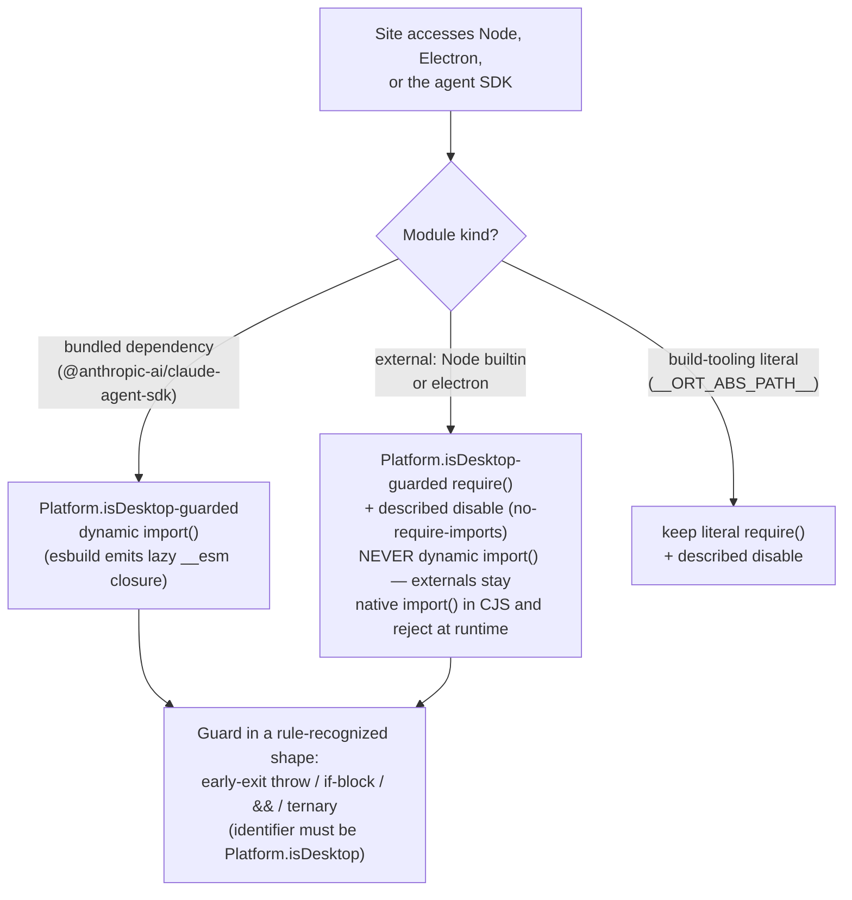
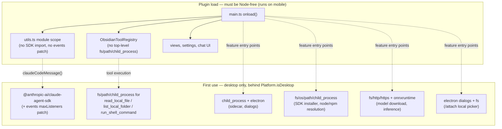

# fix: Remediate Obsidian community scorecard warnings

## Summary

Eliminate the ~240 warnings (30 categories) on the plugin's community.obsidian.md scorecard while keeping mobile support (`isDesktopOnly: false`) and current behavior. Add durable enforcement — `eslint-plugin-obsidianmd` in local lint and `strict: true` in tsconfig — so this class of issue fails locally before the scorecard sees it. Finish with a release, since the scorecard only rescans releases.

---

## Problem Frame

The scorecard at https://community.obsidian.md/plugins/large-language-models shows "Review: Caution" with 240 warnings pinned to release commit `be5f939` (v0.24.23). The scanner is static analysis — `eslint-plugin-obsidianmd` + stylelint — run against each release. Local lint is currently clean only because every flagged rule is either disabled in `eslint.config.mjs` or absent from the local toolchain.

Beyond scorecard standing, the warnings surfaced real defects: three load-time Node `require`s that likely crash the plugin on mobile today despite the manifest claiming mobile support (`src/services/ObsidianToolRegistry.ts` top-level `fs`/`path`/`child_process` imports, the top-level agent-SDK import in `src/utils/utils.ts`, an unconditional `require("path")` in `onload()` at `src/main.ts:413`), a latent `this`-binding bug (`src/utils/utils.ts:454`), and two vulnerable transitive dependencies (`hono` 4.12.23, `protobufjs` 7.6.2).

Warnings don't remove a plugin from the directory (failures do), but "Caution" standing plus Obsidian's stated direction — versions that fail review get pulled from search — makes remediation now, plus local enforcement, the durable fix.

---

## Requirements

**Type safety**
- R1. `npm run build` passes with tsconfig `strict: true` (individual cherry-picked flags removed).
- R2. No explicit `any` in `src/` (`: any` or `as any`); undocumented Obsidian internals are accessed through typed internal interfaces instead.

**Platform / mobile**
- R3. No top-level Node-builtin or Electron imports anywhere in `src/`. All Node/Electron access is lazy and guarded by `Platform.isDesktop` in the exact shapes `obsidianmd/no-nodejs-modules` recognizes (early-exit throw/return at function-body start, `if (Platform.isDesktop)` block, `&&`, or ternary).
- R4. The plugin loads and functions on mobile: cloud-provider chat works; desktop-only features (agent local-file/shell tools, Claude Code SDK, Whisper, RAG embeddings, local-file attach) degrade with clear desktop-only messaging instead of crashing.

**Scorecard rule compliance**
- R5. Popout-window rules clean: `window.`-prefixed timers and `requestAnimationFrame`, `activeDocument` instead of bare `document`, no `globalThis` in `src/`.
- R6. DOM/CSS rules clean except documented residuals: no `innerHTML`/`outerHTML` writes, no static inline styles (dynamic values via `setCssStyles`), `styles.css` `!important`/`:has`/duplicate-property findings fixed or individually justified.
- R7. Remaining ESLint findings clean: `no-misused-promises` (6), `no-unused-expressions` (2), `no-empty-object-type` (1), `TFile` casts replaced with `instanceof` narrowing, every lint-directive comment carries a `-- description`.
- R8. `minAppVersion` stays 1.7.2; the four `ButtonComponent.setDestructive()` calls are gated by `requireApiVersion("1.13.0")` with a fallback.
- R9. `npm audit` shows no advisories for production dependencies: lockfile resolves `hono >= 4.12.25` and `protobufjs >= 7.6.3`.

**Enforcement / durability**
- R10. `npm run lint` runs the scorecard's ESLint rule set locally (obsidianmd recommended preset + re-enabled typescript-eslint rules) and passes with `--max-warnings=0` at completion.
- R11. A release is cut after remediation and a rescan is triggered; residual warnings are enumerated in this plan's Scope Boundaries and nothing else remains.

---

## Key Technical Decisions

- **KTD1 — Module-kind-keyed Node-access pattern.** The **bundled** agent SDK is the only dynamic-`import()` candidate: esbuild wraps bundled modules in lazy `__esm` closures, so a `Platform.isDesktop`-guarded `import()` defers its module-scope code (verified against this repo's exact build settings — see KTD8). **External modules — Node builtins and `electron` — keep guarded `require()`**: esbuild does *not* lower dynamic `import()` of externals in CJS output; it stays a native `import()` that rejects at runtime (verified by probe). Guarded `require()` satisfies `obsidianmd/no-nodejs-modules` — the guard must be the literal `Platform.isDesktop` identifier in a rule-recognized shape — and carries a described `eslint-disable` for `no-require-imports` only, a rule not on the preset's `no-restricted-disable` ban list. `require("__ORT_ABS_PATH__")` (`src/RAG/EmbeddingService.ts:295`) additionally stays a literal require — `esbuild.config.mjs`'s `patchBundle()` rewrites that exact string.
- **KTD2 — `minAppVersion` stays 1.7.2.** `setDestructive()` requires Obsidian 1.13.0, which is Catalyst-only (latest public release: 1.12.7). Bumping now would cut off every non-Catalyst user. Gate call sites with `requireApiVersion("1.13.0")` (accepted by `obsidianmd/no-unsupported-api`), falling back to `setWarning()`. Revisit the bump when 1.13 goes public (tracked in Deferred).
- **KTD3 — Advisories fixed by lockfile refresh, not overrides.** All dependents' semver ranges already admit the patched versions (`hono ^4.11.4` → 4.12.25+; `protobufjs ^7.5.4`/`^7.2.4` → 7.6.3+), so `npm update hono protobufjs` suffices; `package.json` is untouched.
- **KTD4 — Typed internal interfaces replace sanctioned `as any`.** The preset bans `eslint-disable` for `no-explicit-any`, so suppression can't clear the ~20 undocumented-internals casts. A new `src/Types/obsidian-internals.ts` defines minimal typed shapes (`app.setting`, `app.commands`, `workspace.rightSplit`, `Menu.setSubmenu`, `vault.adapter.basePath/getBasePath`, `app.internalPlugins`), accessed via `as unknown as <Interface>`. CLAUDE.md's `as any` convention is updated to point at this module.
- **KTD5 — Whisper upload moves to `requestUrl` with a hand-built multipart body.** `requestUrl` supports neither streaming nor `FormData`; the Whisper upload (`src/Whisper/WhisperService.ts:198`) doesn't stream and its payload is already buffered, so encoding multipart into an `ArrayBuffer` clears the only flagged `fetch`. Provider streaming paths are untouched (none were flagged).
- **KTD6 — Lint lands at `warn` first, ratchets to zero last.** U1 installs the full rule set at warn severity so every subsequent unit is locally verifiable without blocking `lint`; the final unit flips severities up and adds `--max-warnings=0`. tsconfig flips to `strict: true` early (U2) because the measured delta is only 35 errors in 6 files.
- **KTD7 — `globalThis` handshake: change the read side only.** `src/RAG/EmbeddingService.ts:288-289` reads the ONNX runtime that the esbuild banner stores at `globalThis[Symbol.for("onnxruntime")]`. In the Electron renderer `window === globalThis`, so the src side switches to `window[...]` (satisfying `obsidianmd/no-global-this`) while the banner — which the scanner never sees — keeps writing to `globalThis`. The banner/define pair is not modified.
- **KTD8 — Agent SDK becomes a desktop-gated lazy import.** The top-level `@anthropic-ai/claude-agent-sdk` import in `src/utils/utils.ts:15` currently inlines the SDK *unwrapped* — ~30 builtin `require`s execute at plugin load on every platform. With the static import replaced by a guarded dynamic `import()`, esbuild emits the SDK as a lazy `__esm` closure executed on first import (verified empirically with this repo's esbuild version, flags, and banner). Two hardening consequences: laziness silently reverts to eager if *any* static value-import of the SDK survives anywhere in the graph — the type-position use (`CanUseTool`, `src/utils/utils.ts:307`) becomes an explicit `import type` — and U4 adds a post-build check that the bundle actually wraps the SDK lazily. The `import.meta.url` banner/define shim works inside the lazy closure and stays exactly as is.

---

## High-Level Technical Design

### Per-site Node/Electron access decision

### Load-time vs first-use module graph (target state)

### Warning-category → unit traceability

| Scorecard category | Count | Fix pattern | Unit |
|---|---|---|---|
| Unexpected `any` | 87 | catch-clauses via `getErrorMessage` (U2); plumbing/payload/parse typing (U6); internals interfaces (U7) | U2, U6, U7 |
| `require()` imports forbidden | 42 | SDK site via dynamic `import()`; externals keep guarded `require()` + described disables (KTD1) | U4, U5 |
| Node builtins (`path`/`fs`/`child_process`/`os`/`http`/`https`/`events`) | 40 | `Platform.isDesktop` guards in rule-recognized shapes (KTD1) | U4, U5 |
| Popout compat (rAF, timers, `document`, `globalThis`, `activeWindow` timers) | 20 | `window.*` / `activeDocument` / KTD7 | U8 |
| `!important` / `:has` / duplicate `color` (styles.css) | 14 | specificity rework, JS class toggle, cleanup + residuals | U9 |
| Inline style assignment | 9 | `setCssStyles` for dynamic, class for static | U8 |
| Dependency advisories (`hono`, `protobufjs`) | 6 | lockfile refresh (KTD3) | U3 |
| `no-misused-promises` | 6 | `void`-wrapper / async-IIFE pattern | U7 |
| APIs newer than `minAppVersion` (`setDestructive` ×4) | 4 | `requireApiVersion` gate (KTD2) | U8 |
| `innerHTML` writes | 2 | DOM construction from existing inline-SVG assets | U8 |
| `no-unused-expressions` | 2 | ternary → `if/else` (keeps native `.show()/.hide()`) | U7 |
| Singles: `fetch`, `TFile` cast, `{}` type, undescribed directive | 4 | KTD5; `instanceof`; `Record<string, never>`; `-- description` | U6, U7, U8 |
| System-identity read | 1 | accepted residual (inherent to SDK installer) | — |
| Node globals / bundled-dep findings outside `src/` | ~3 | not addressable in source; documented | — |

---

## Implementation Units

Phases: **A. Foundation** (U1–U3) → **B. Platform safety** (U4–U5) → **C. Type safety** (U6–U7) → **D. UI & styles** (U8–U9) → **E. Ratchet & release** (U10). Units within a phase are independent unless noted.

### U1. Local lint parity with the scorecard

- **Goal:** `npm run lint` reports what the scorecard reports, so every later unit is locally verifiable.
- **Requirements:** R10 (foundation for all others).
- **Dependencies:** none.
- **Files:** `eslint.config.mjs`, `package.json`, `package-lock.json`.
- **Approach:** Install `eslint-plugin-obsidianmd@0.4.0`; adopt `obsidianmd.configs.recommended` in the flat config with type-aware `parserOptions` (the config already uses `projectService: true`). Re-enable the locally-disabled rules the scorecard flagged (`no-explicit-any`, `no-require-imports`, `no-unused-expressions`, `no-empty-object-type`) at **warn** severity for the migration window (KTD6). Keep the existing `no-console` logger carve-out. Record the baseline warning count per category and compare against the scorecard inventory (traceability table above).
- **Patterns to follow:** flat-config shape from the plugin README; existing type-aware block in `eslint.config.mjs`.
- **Test scenarios:** Test expectation: none — configuration only. Verification below stands in.
- **Verification:** `npm run lint` exits 0 (warnings allowed); reported categories match the scorecard inventory to within the known deltas (CSS categories come from stylelint, not ESLint; bundled-dep findings are outside `src/`). `npm run build` unaffected. Note: peer range mismatch is possible (`@eslint/js` 10.0.1 vs plugin peer `^9.30.1`) — resolve at install time and record the outcome.

### U2. tsconfig strict flip and error-handling foundation

- **Goal:** `strict: true` compiles clean; catch-clause `any`s eliminated codebase-wide.
- **Requirements:** R1; ~25 of R2's sites.
- **Dependencies:** none (parallel with U1).
- **Files:** `tsconfig.json`, `src/utils/utils.ts` (new `getErrorMessage` helper here or alongside `src/utils/logger.ts`), `src/main.ts`, `src/Plugin/Components/ChatContainer.ts`, `src/Plugin/Components/HistoryContainer.ts`, `src/Plugin/Components/SettingsContainer.ts`, `src/Settings/LLMSettingsModal.ts`, plus catch-clause sites in `src/services/ObsidianToolRegistry.ts`, `src/services/AgentLoop.ts`, `src/RAG/EmbeddingService.ts`, `src/Whisper/WhisperService.ts`.
- **Approach:** Measured delta is 35 errors in 6 files. Fix TS2564 ×25 with constructor initialization where cheap, definite-assignment (`!`) where lifecycle-assigned (fields set in `onOpen()`/`generate()`); fix the `this`-binding bug in `processReplacementTokens` (`src/utils/utils.ts:454` — a real runtime defect, not just typing); fix the remaining TS2345/TS2339/TS2322/TS18046 individually. Introduce `getErrorMessage(e: unknown): string` and sweep every `catch (e: any)` to bare `catch (e)` + helper (`useUnknownInCatchVariables` enforces this once strict is on). Then set `strict: true` and delete the now-redundant individual flags.
- **Execution note:** enable flags incrementally in the research-established order (strictBindCallApply → noImplicitThis → strictFunctionTypes → useUnknownInCatchVariables → strictPropertyInitialization), fixing per flag, then flip `strict: true`.
- **Test scenarios:**
  - Prompt containing a replacement token (e.g. active-note token) resolves correctly after the `this`-binding fix — the token substitution path is the one with the latent bug.
  - Stop-button abort still renders partial text and saves history: the `error.name === "AbortError"` check must survive `unknown`-narrowing (input: start generation, click stop mid-stream; expected: graceful stop, no error notice).
  - A provider error (invalid API key) still surfaces its message text via `getErrorMessage`, not `[object Object]`.
- **Verification:** `npm run build` green; `npm run lint` shows the explicit-`any` count reduced by the catch-clause bucket (~25).

### U3. Dependency advisory refresh

- **Goal:** production-dependency advisories cleared.
- **Requirements:** R9.
- **Dependencies:** none (parallel).
- **Files:** `package-lock.json` only.
- **Approach:** `npm update hono protobufjs`; verify resolutions with `npm ls hono protobufjs` (`hono >= 4.12.25`, `protobufjs >= 7.6.3`). Optionally take the cheap dev-chain patches (esbuild 0.28.1) in the same pass; the wdio/mocha dev-only chain is deferred (Scope Boundaries) if it needs a major bump.
- **Test scenarios:** Test expectation: none — lockfile-only change within existing semver ranges.
- **Verification:** `npm audit` shows zero production advisories; `npm run build` and one E2E smoke run green (MCP/agent-SDK paths exercise `hono` transitively).

### U4. Mobile load-safety: eliminate load-time Node execution

- **Goal:** the plugin's load graph is Node-free; mobile loads without crashing.
- **Requirements:** R3, R4 (the load-time half); part of the R3 counts in the traceability table.
- **Dependencies:** U2 (strict typing of reworked signatures).
- **Files:** `src/services/ObsidianToolRegistry.ts`, `src/utils/utils.ts`, `src/main.ts`, `src/Settings/LLMSettingsModal.ts`, `src/Plugin/ObsidianAgent/ObsidianAgent.ts` (tool registration), `src/RAG/EmbeddingService.ts` (configure-path gating).
- **Approach:** The hazards, hardest first:
  1. `src/utils/utils.ts:15` top-level SDK import → desktop-gated dynamic `import()` inside `claudeCodeMessage()` (`src/utils/utils.ts:300-357`), the SDK's only runtime consumer — already async, already platform-guarded at :309, sole caller is the awaited send path (`src/Plugin/Components/ChatContainer.ts:517`). Convert the type-position use (`CanUseTool`, :307) to an explicit `import type` so no static value-edge survives (KTD8). Move the module-scope `events`/`setMaxListeners` patch (`utils.ts:22-34`) into the same lazy path — it only needs to run before the SDK's `query()` executes.
  2. `src/services/ObsidianToolRegistry.ts:2-4` top-level `fs`/`path`/`child_process` → guarded lazy access inside the three tool implementations per KTD1. **Registration filtering is advertisement; `executeTool` guards are enforcement**: `executeTool` routes any requested name through its switch regardless of `getTools()` filtering, so the `Platform.isDesktop` guard lives inside the `read_local_file`/`list_local_folder`/`run_shell_command` case bodies and short-circuits **before** the permission gate (`getRisk` falls back to `"danger"` for these names — a mobile user must not see a permission card for a tool that cannot succeed). The existing try/catch at :774-776 converts guard throws into recoverable `{success: false}` tool errors. On mobile, also exclude the three tools from `getTools()` so the model doesn't see them.
  3. `src/main.ts` RAG arm-up: gate the ONNX warm-up (`:417-419`) *and* `registerRagVaultEvents` (`:424`) on `Platform.isDesktop`, not just the `pluginOsDir` computation at `:413` — `EmbeddingService.configure` is already Node-free, but ungated vault-event handlers would re-attempt embedding on every file modify on mobile.
  4. `src/Settings/LLMSettingsModal.ts:975`: `renderAnthropic()` is a synchronous render path (also calls sync `isSDKInstalled`, which requires `fs`) — gate the SDK-install section on `Platform.isDesktop` with a desktop-only notice before any Node access; the KTD1 external-module pattern (guarded `require()`) applies, not dynamic import.
  5. Model dropdown (`src/Plugin/Components/ChatContainer.ts:3210`): exclude Claude Code entries on mobile — the existing send-path throw is a raw error, not R4-grade messaging, and a desktop-selected Claude Code model syncs in via `data.json`.
- **Execution note:** after building, verify against the configured outfile (`../large-language-models/main.js`, not any stale root `main.js`) that the SDK section sits inside an `__esm({` closure and its import site lowers to a lazy `Promise.resolve().then(...)` call — a surviving static import silently re-eagerizes the SDK with no build error. Banner shim must appear unchanged.
- **Test scenarios:**
  - Desktop: Claude Code chat round-trip works after lazy-load conversion (input: send a message on the Claude Code endpoint; expected: streamed response identical to pre-change, first-use latency only on the first send).
  - Desktop: `read_local_file` happy path and `run_shell_command` confirm-flow still work through the agent.
  - Mobile (emulator or device — manual), using a **desktop-synced `data.json`** (RAG enabled + model cached, Whisper enabled, Claude Code as the selected model): plugin enables without error; chat with a cloud provider works; no repeated embedding attempts on file edits; model dropdown omits Claude Code; agent tool list omits the three local tools; RAG/Whisper/Claude-Code settings sections show desktop-only messaging; opening settings does not throw.
  - Mobile: model names an excluded tool mid-conversation (stale skill or prompt injection): `tool_result` carries the desktop-only error string, no permission card is shown, the conversation continues.
  - Mobile: a skill/assistant whose `allowedTools` names only the excluded local tools runs tool-less with the degrade logged (`getFilteredTools` intersection goes empty).
- **Verification:** `npm run lint` shows zero Node-builtin warnings for these files; grep confirms no top-level `require(`/`from "fs|path|child_process|os|http|https|events"` outside guards; post-build bundle check above passes; E2E suite green.

### U5. Lazy-require sweep: align remaining sites to the KTD1 pattern

- **Goal:** every remaining `require()` call site conforms to KTD1; `no-require-imports` and `no-nodejs-modules` are clean.
- **Requirements:** R3 (remaining counts).
- **Dependencies:** U4 (pattern precedent; avoids merge conflicts in shared files).
- **Files:** `src/services/ClaudeAgentSDKInstaller.ts`, `src/Whisper/WhisperService.ts`, `src/Whisper/SidecarManager.ts`, `src/Whisper/TranscribeCommand.ts`, `src/Plugin/Components/ChatContainer.ts` (lazy `fs`/`path` at 515/1033-1034, electron dialogs at 3059-3072/4551), `src/main.ts:1369` (Keychain `execSync`), `src/utils/utils.ts:311`, `src/services/FileSystem.ts`, `src/services/OperatingSystem.ts`, `src/RAG/EmbeddingService.ts` (lazy `fs`/`path`; the `__ORT_ABS_PATH__` disable).
- **Approach:** These are all *external* modules (builtins + `electron`), so per KTD1 they keep lazy `require()` — no dynamic-import conversion, no async signature ripple. The sweep is: hoist each site's platform guard into a rule-recognized shape where it isn't already (early-exit `if (!Platform.isDesktop) throw/return` at function-body start, or an `if (Platform.isDesktop)` block — the identifier must be literally `Platform.isDesktop`), and add a described `eslint-disable` for `no-require-imports` at each site. `EmbeddingService.ts:295` keeps its literal require + described disable (build contract). The `DesktopFileSystem`/`DesktopOperatingSystem` constructors already conform — they only need the described disables.
- **Patterns to follow:** the `as typeof import("x")` typing convention already used at `src/Whisper/WhisperService.ts:90`; guard shapes per KTD1/HTD.
- **Test scenarios (desktop, manual where E2E can't reach):**
  - Whisper: record + transcribe round-trip (sidecar pip-install path if not installed; spawn; transcription result lands in note).
  - SDK installer: fresh install flow resolves node/npm (one manager path, e.g. nvm) and installs; re-run detects existing install.
  - `/attach`: picker opens, attaches a file and a directory, contents injected at send.
  - macOS Keychain token read still resolves (or silently no-ops off-macOS).
  - RAG: embedding model download progress + hybrid search over a small vault.
- **Verification:** `npm run lint` — zero `no-require-imports`/`no-nodejs-modules` findings outside the enumerated described-disable sites; every disable has a `-- reason`; E2E green.

### U6. Type the data plane: tool plumbing, provider payloads, JSON parses

- **Goal:** the `Record<string, any>`/payload/parse buckets of the 87 `any`s are gone.
- **Requirements:** R2 (bulk).
- **Dependencies:** U2 (strict on; `getErrorMessage` exists).
- **Files:** `src/Types/types.ts` (`ToolCallRecord.input`, `GPT4AllSettings` `{}` → `Record<string, never>`), `src/services/AgentLoop.ts`, `src/services/ObsidianToolRegistry.ts`, `src/Plugin/Components/ChatContainer.ts` (stream normalization at 530/1648-1682, plumbing at 1743/1753/1989), `src/Memory/MemoryService.ts:261`, `src/services/ChatHistory.ts:502`, `src/RAG/EmbeddingService.ts` (`tokJson`, expanded `OrtLike` interface), `src/Whisper/WhisperService.ts:147-148` (local `verbose_json` interface), `src/Plugin/StatusBar/RecentChatsButton.ts:200`, `src/Settings/LLMSettingsModal.ts` (dropdown `onChange` params).
- **Approach:** One coherent ripple: `Record<string, any>` → `Record<string, unknown>` across the tool-input plumbing, with narrowing at the tool-execution boundary (each tool already validates its own input shape). Provider/SDK stream payloads move to the SDKs' discriminated unions where they exist (`@anthropic-ai/sdk` stream events, agent-SDK message types); where the code deliberately normalizes cross-provider shapes (`ChatContainer` tool-message normalization), define small local structural interfaces rather than importing SDK types. JSON parses go `unknown` + narrowing guards. `OrtLike` grows the members currently accessed through `any` — local interface, not onnxruntime type imports (types absence is deliberate).
- **Patterns to follow:** existing `OrtLike` local-interface approach; the normalization comment at `ChatContainer.ts:1648` explains intent — preserve it.
- **Test scenarios:**
  - Agent tool-call round trip with each of: valid input, missing required field, wrong-typed field (expected: tool executes / returns a validation error string; no throw).
  - Anthropic and OpenAI-compatible streaming each with a tool call mid-stream (expected: identical rendering to pre-change; usage totals still recorded).
  - Memory extraction on a malformed model reply (invalid JSON) — graceful skip, no crash.
  - Legacy chat-file load (`ChatHistory` parse) of an existing saved chat with tool-call callouts.
  - Whisper `verbose_json` transcription still yields segment text.
- **Verification:** `npm run lint` explicit-`any` count reduced to the internals bucket only (U7's scope); build + E2E green.

### U7. Typed Obsidian/Electron internals and the callback-hygiene singles

- **Goal:** the remaining `any`s (undocumented internals, Electron), `TFile` casts, misused promises, unused expressions, and the undescribed directive are gone.
- **Requirements:** R2 (remainder), R7.
- **Dependencies:** U6 (shared files; lands after the bulk ripple).
- **Files:** new `src/Types/obsidian-internals.ts`; `src/Plugin/Components/ChatContainer.ts` (`app.setting`, `setSubmenu`, electron picker shapes), `src/main.ts` (`rightSplit`, adapter `basePath`, `leaf.view`), `src/Settings/LLMSettingsModal.ts` (`app.setting`, adapter, `TFile` cast at 2669, directive at 597, misused-promises at 1426/2372), `src/Plugin/Components/Header.ts:93`, `src/Plugin/Components/ChatRowMenuHelper.ts` (145, misused-promises at 209/228), `src/Plugin/ChatDetailsView/ChatDetailsRenderer.ts` (`openFile(tfile as any)` ×4 → `instanceof TFile`, `internalPlugins`), `src/Whisper/SidecarManager.ts:175`, `src/services/ObsidianToolRegistry.ts` (adapter, `app.commands`), `src/Whisper/TranscribeUtils.ts:17`, `src/main.ts:669` (misused-promises), `src/Plugin/Components/SettingsContainer.ts:332` + `src/main.ts:1084` (unused expressions → `if/else`, keeping native `.show()/.hide()` per `.claude/rules/obsidian-styling.md`), `CLAUDE.md` (convention update per KTD4).
- **Approach:** KTD4 interfaces, accessed `as unknown as <Interface>`; Electron picker/dialog results get minimal local interfaces (no `@types/electron` — its absence is deliberate). Misused-promises sites get the `void`-operator wrapper (or async IIFE with `.catch`) — the `setInterval` case at `LLMSettingsModal.ts:2372` wraps its async callback. `TFile` narrowing via `instanceof` follows the CLAUDE.md convention that already prefers it.
- **Test scenarios:**
  - Chat row menu: every row action (open, rename, delete, move) still fires — these run through the converted async handlers.
  - Settings modal: the interval-driven status refresh still updates (the wrapped `setInterval` callback), and rejects are logged, not unhandled.
  - Open-chat-file from Chat Details and sidebar rows still opens (the ×4 `openFile` sites with `instanceof` narrowing — including the not-a-TFile edge: path no longer exists → no-op or notice, no throw).
  - Submenu items (Header tab menu, row menus) still render on both 1.7-era and current Obsidian.
- **Verification:** `npm run lint` — zero explicit-`any`, misused-promises, unused-expressions, undescribed-directive findings; build + E2E green.

### U8. Popout-window, DOM, and in-TS style compliance

- **Goal:** popout rules, `innerHTML`, inline styles, the `setDestructive` gate, and the Whisper upload are clean.
- **Requirements:** R5, R6 (TS side), R8; the `fetch` single from R7's table row.
- **Dependencies:** U2 (strict); independent of U4–U7 except shared-file ordering with `ChatContainer.ts`.
- **Files:** `src/Plugin/Components/ChatContainer.ts` (rAF 2926/3712, innerHTML 3854/4149, textarea measurement 2487-2495, mirror padding 2934-2938), `src/Plugin/Components/ChatRowMenuHelper.ts:28`, `src/Plugin/FAB/FAB.ts` (179/246), `src/Plugin/StatusBar/RecentChatsButton.ts` (27, 117/196/241, popover position 231), `src/Plugin/StatusBar/StatusBarButton.ts` (87, 260/314/360), `src/Settings/LLMSettingsModal.ts` (2688, timers 2331/2372, static width 2151, `setDestructive` 1276/1871/1981/2751), `src/Plugin/Widget/Widget.ts:249`, `src/main.ts` (473/478), `src/RAG/EmbeddingService.ts:288-289` (KTD7), `src/Whisper/WhisperService.ts:198` (KTD5), `styles.css` (new class for the static width).
- **Approach:** Mechanical `window.`-prefixing for rAF/timers (note the rule's direction: `activeWindow.setTimeout` at `main.ts:473/478` also rewrites to `window.setTimeout`); `document.body` popover mounts → `activeDocument.body` (matching the pattern already used across FAB/HistoryContainer/LLMSettingsModal). **Owner-document invariant for every converted site:** resolve the target document once at mount and retain element/listener references; never re-resolve `activeDocument` at teardown — the resolve-at-teardown asymmetry is a live leak pattern (`RecentChatsButton` adds close listeners via `activeDocument.addEventListener` at :259-260 but removes via a fresh `activeDocument` at :270/:274; the toggle-FAB command `main.ts:1080-1087` can mount via `FAB.ts:195` in one window and remove via `:314` in another; status-bar popovers are rebuilt from a settings toggle at `LLMSettingsModal.ts:687-688` and the status bar exists only in the main window — mount them to the status-bar element's own document). `innerHTML` SVG injections rebuilt from the existing inline-SVG asset pipeline via DOM construction (`createSvg`/`DOMParser` on the imported asset — decide at implementation; no string assignment to `innerHTML`). Dynamic measurements move to `setCssStyles()` (sanctioned for dynamic values per `.claude/rules/obsidian-styling.md`); the one static width becomes an `llm-` class. `setDestructive` per KTD2. Whisper multipart per KTD5, isolated in a small encoder helper for easy revert.
- **Test scenarios:**
  - Popout window (manual): move the chat widget to a popout — slash menu positioning, textarea autogrow, send/stop, FAB and status-bar popovers, recent-chats popover all function in the popout; timers fire (settings status refresh) with the popout focused.
  - Cross-window teardown: open the recent-chats popover, focus a popout window, close the popover — the close listener is removed from the document it was added to (no leak, no stranded popover). Run the toggle-FAB command while a popout is focused — the FAB mounts and removes in the same document.
  - Textarea autogrow: type multi-line input; height tracks content exactly as before (the measurement sites).
  - SVG-bearing UI (the two innerHTML sites) renders identically.
  - Danger buttons: on public Obsidian (≤1.12) show the `setWarning` fallback; on Catalyst 1.13 show destructive styling (`requireApiVersion` gate both ways).
  - Whisper file transcription round-trip through the new multipart encoder — success, and error paths: sidecar down (connection refused → user-visible error), non-audio file (sidecar 4xx surfaces message). Verify filename and content-type reach the sidecar (it routes on them).
- **Verification:** `npm run lint` — zero popout/innerHTML/static-style findings; grep for `.style.` in `src/` returns only `setCssStyles` usage; manual popout checklist complete.

### U9. Stylesheet compliance (`styles.css`)

- **Goal:** stylelint-side findings fixed or explicitly retained.
- **Requirements:** R6 (CSS side).
- **Dependencies:** none (parallel with U8; both touch `styles.css` — coordinate).
- **Files:** `styles.css`.
- **Approach:** Duplicate `color` (~1443-1448): delete the stale declaration. `:has` at 891 (FAB resize-handle hover) → JS hover-class toggle on the handle (matches the plugin's class-toggle conventions); `:has` at 2824 (chats-row flair stacking guard) → attempt selector restructure, retain with justification if it guards behavior that has no non-`:has` equivalent. `!important` ×11: `.llm-hidden` (1411) is load-bearing by design — retained residual; for the caret-mirror (397-398), message-bubble transparency vs markdown-preview theme styles (498-500/550-552), `font-size: initial` (796), and margin (1128), attempt specificity-based replacement; where the override target is Obsidian's own theme-injected styles and specificity can't win cleanly, retain and document.
- **Test scenarios:** visual pass in light and dark themes: message bubbles (transparency), caret alignment in the input mirror, FAB resize-handle hover affordance, chats-panel row-menu flair hover, settings text sizing. Test expectation: manual visual verification — no automated CSS coverage exists.
- **Verification:** remaining `!important`/`:has` occurrences each have a comment justifying retention; the residual count feeds R11's enumeration.

### U10. Enforcement ratchet, docs, release, rescan

- **Goal:** regressions fail locally; the scorecard reflects the remediation.
- **Requirements:** R10, R11.
- **Dependencies:** U1–U9 all landed.
- **Files:** `eslint.config.mjs`, `package.json` (lint script `--max-warnings=0`), `CLAUDE.md` (conventions: KTD1 pattern, KTD4 internals module, residuals list), `manifest.json`/`versions.json` (release version bump only — `minAppVersion` unchanged), this plan (residual enumeration confirmed).
- **Approach:** Raise the migration-window `warn` severities to match the preset's defaults; add `--max-warnings=0` to the lint script; confirm every remaining directive comment is described and belongs to the enumerated residual set. Cut a release via the existing `npm run version` flow, then trigger the scorecard's "Check for new releases" on community.obsidian.md (requires a registered account — user action) and verify the new scan against the expected residual list.
- **Test scenarios:** Test expectation: none — enforcement/config/release mechanics. Verification below stands in.
- **Verification:** `npm run build && npm run lint && npm run test:e2e` all green at `--max-warnings=0`; post-rescan scorecard shows only the enumerated residuals (expected: system-identity disclosure, `.llm-hidden` `!important`, any justified `!important`/`:has` retentions from U9, bundled-dep findings outside `src/`).

---

## System-Wide Impact

- **Settings sync (`data.json`) is the cross-device failure channel.** Desktop-written state arms mobile behavior: `ragSettings.enabled` + a cached model fires the ONNX warm-up and per-file-modify embedding attempts (`src/main.ts:417-424`); `whisperSettings.enabled` arms the mic button and transcribe command (`src/main.ts:962-967`, `:1118-1128`); a desktop-selected Claude Code model syncs into `widgetSettings`/`modalSettings`/`fabSettings` and the model dropdown lists Claude Code whenever a Claude key exists (`src/Plugin/Components/ChatContainer.ts:3210`). U4 gates each at its consumption point, and the mobile test scenarios use a desktop-synced `data.json` as first-class input.
- **Tool availability is advertisement plus enforcement.** `getTools()` filtering only changes what the model sees; any tool name can still arrive at `executeTool` mid-conversation, so the case-body guards are the enforcement layer and short-circuit before the permission gate. A skill/assistant whose `allowedTools` intersects to empty on mobile (`AgentLoop.getFilteredTools`, `src/services/AgentLoop.ts:75-82`) runs tool-less — a logged degrade, not an error.
- **Saved chats are portable across the gate.** Tool callouts in chat files are display-only and stripped on load (`ChatHistory.markdownToMessages`, `src/services/ChatHistory.ts:410`), so a desktop-saved chat containing local-tool callouts renders and resubmits safely on mobile.
- **The popout rewrite imports a time-of-call asymmetry.** `activeDocument` resolved at teardown can be a different document than at mount; U8's capture-once invariant is what keeps the mechanical rewrite from converting warnings into listener leaks and stranded UI.
- **The esbuild banner is already mobile-tolerant** — the `import.meta.url` shim guards on `typeof __filename` and the ORT injection is try/catch-wrapped (`esbuild.config.mjs:20-31`). It requires no changes in this work and must not be touched defensively during U4.

---

## Scope Boundaries

### Accepted residuals (will still appear on the scorecard)

- "Plugin reads system identity information" — inherent to the SDK installer's `os.homedir()`/env-based node-manager resolution and the Whisper sidecar; removing it means removing the features.
- `.llm-hidden { display: none !important }` — load-bearing by design (`.claude/rules/obsidian-styling.md`); the show/hide contract depends on it.
- Any `!important`/`:has` retentions from U9 where the override target is Obsidian theme-injected styling (enumerated with in-file justifications during U9).
- Findings attributable to bundled dependency code in `main.js` rather than `src/` — not addressable in source.

### Deferred to follow-up work

- Bump `minAppVersion` to 1.13.0 and drop the `requireApiVersion` gates once Obsidian 1.13 reaches public release (removes the `setWarning` deprecation exposure too).
- Dev-only advisory chain (wdio-bundled mocha: `serialize-javascript`, `diff`) — requires a wdio-side upgrade; no production exposure.
- Local stylelint adoption for CSS-side parity with the scanner — one-time CSS fixes land in U9; tooling parity is optional follow-up.
- Document (or restructure) the `@huggingface/transformers` dependency's real role — it exists only to place `onnxruntime-node` on disk for the esbuild banner injection.
- Mobile feature parity for currently desktop-only features (e.g., `vault.adapter`-based embeddings without onnxruntime-node) — out of this plan's identity; this plan only makes mobile *safe*, not feature-complete.

### Non-goals

- No feature removals or UX changes beyond mobile hiding tools/sections it cannot support.
- No provider-streaming architecture changes (`fetch` in streaming paths was not flagged and `requestUrl` cannot stream).
- No broad refactor of `ChatContainer.ts` beyond the flagged sites — the render-generation guard, stop-button wiring, and scan-chip invariants (CLAUDE.md) are explicitly out of bounds.

---

## Risks & Dependencies

- **Agent-SDK lazy-load (U4) is the highest-risk change, now empirically de-risked.** Probe builds with this repo's exact esbuild settings confirm the lazy `__esm` wrapping and that the banner shim works inside the closure. The residual hazard is *silent re-eagerization*: one surviving static value-import anywhere re-inlines the SDK eagerly with no error. Mitigation: the `import type` conversion, the post-build bundle check in U4's execution note, and a Claude Code round-trip test. Rollback is confined to one import-site change.
- **Do not convert external/builtin requires to dynamic `import()`.** esbuild leaves dynamic `import()` of external modules as native `import()` in CJS output, which rejects at runtime (probe-verified). KTD1 keys the pattern on module kind; a well-meaning "modernization" during implementation would break Whisper/installer/attach at runtime while passing the type-checker.
- **Behavioral drift across ~25 files.** Every category is individually mechanical, but volume is the risk. Mitigation: unit-per-commit sequencing, E2E after each phase, and the per-unit manual checklists (popout, Whisper, installer, /attach, mobile) — several flows have no automated coverage.
- **`no-explicit-any` autofix (`fixToUnknown`) can break compiles** — do not bulk-autofix; the buckets in U2/U6/U7 are deliberate manual passes.
- **Peer-dependency mismatch at U1** (`@eslint/js` 10.x vs plugin peer `^9.30.1`) may need an install workaround; if the preset can't load under ESLint 10, fall back to enabling the individual `obsidianmd/*` rules explicitly.
- **The scorecard's exact config is not fully reproducible locally** (its CSS side is stylelint; severity choices differ — e.g. `prefer-active-doc` is off in the published recommended preset but evidently on in the scanner). Residual risk: small count deltas at rescan. Mitigation: R11 verifies against the enumerated residual list, not zero.
- **Whether "Review: Caution" clears automatically once warnings drop is undocumented.** If standing doesn't update after a clean rescan, escalate via the scorecard's report-inaccuracy channel (Discord `#plugin-dev`).
- **Rescan cadence is release-driven** (~observed 2-week lag; manual trigger requires a community.obsidian.md account) — verification of R11 trails the code work.

---

## Sources & Research

- Scorecard page + extracted inventory (30 categories, per-file/line occurrences, pinned to release commit `be5f939`): https://community.obsidian.md/plugins/large-language-models
- Scanner identity and rescan behavior: https://obsidian.md/blog/future-of-plugins/ ; https://forum.obsidian.md/t/score-card-review-update-interval/114714
- `eslint-plugin-obsidianmd` 0.4.0 (rule sources verified — guard-shape AST matching in `no-nodejs-modules`, `no-restricted-disable` ban list, `requireApiVersion` acceptance in `no-unsupported-api`): https://github.com/obsidianmd/eslint-plugin
- Popout-window guidance: https://obsidian.md/blog/how-to-update-plugins-to-support-pop-out-windows/
- `requestUrl` streaming/FormData limitations: https://forum.obsidian.md/t/support-streaming-the-request-and-requesturl-response-body/87381
- Advisories (verified against this repo's lockfile 2026-07-01): hono GHSA-88fw-hqm2-52qc et al., all fixed 4.12.25; protobufjs GHSA-f38q-mgvj-vph7, fixed 7.6.3. Both reachable by lockfile refresh — dependent ranges admit them.
- Obsidian API `@since` mapping (obsidian.d.ts diffed across npm versions): `setDestructive` @since 1.13.0; 1.13 is Catalyst-only, public is 1.12.7 (https://obsidian.md/changelog/); release-process guidance for `versions.json`: https://github.com/obsidianmd/obsidian-sample-plugin
- TypeScript 6.0 strict-family defaults and measured strict delta (35 errors / 6 files, distribution in U2): local `tsc` runs against this repo
- esbuild lazy-wrapping behavior (KTD1/KTD8): probe bundles built with this repo's exact esbuild version, flags, externals, and banner — bundled modules imported only dynamically emit as `__esm` closures executed on first `import()`; any surviving static import re-eagerizes silently; dynamic `import()` of *external* modules stays native and rejects at runtime in CJS
- Repo constraints that bound this work: `esbuild.config.mjs` banner/define contract (`__ORT_ABS_PATH__`, `import.meta.url` shim, ONNX `globalThis` handshake); `.claude/rules/obsidian-styling.md` (`.llm-hidden`, native `.show()/.hide()`, dynamic-only inline styles); `test/README.md` E2E conventions
